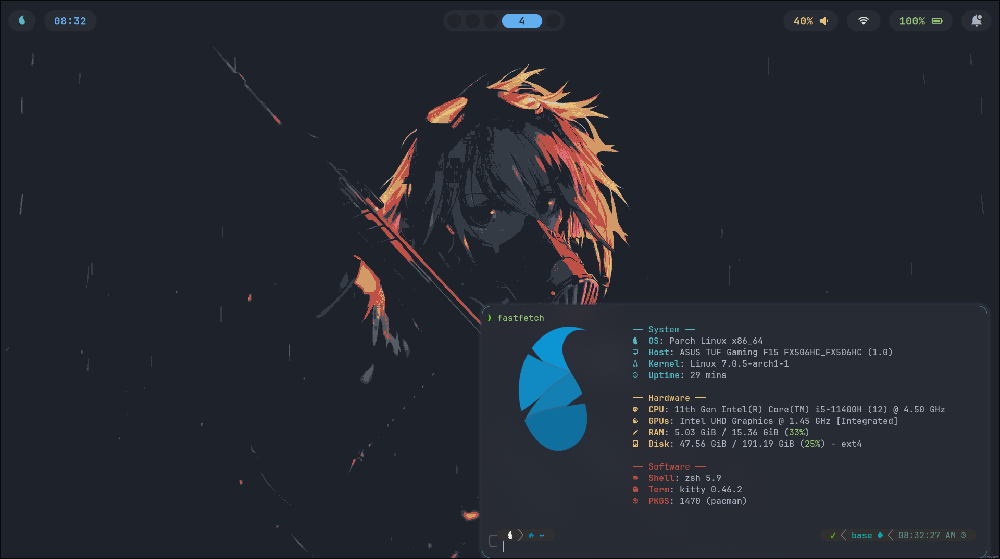
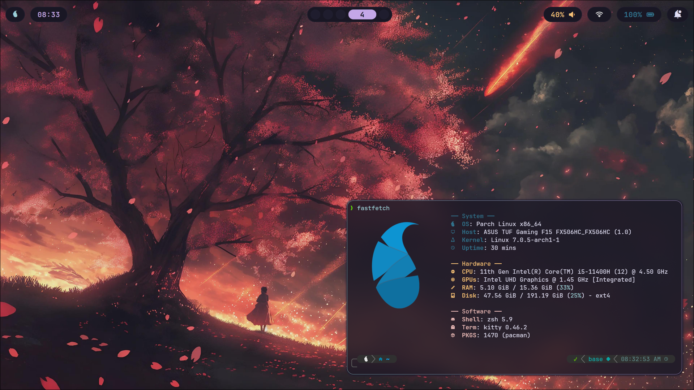
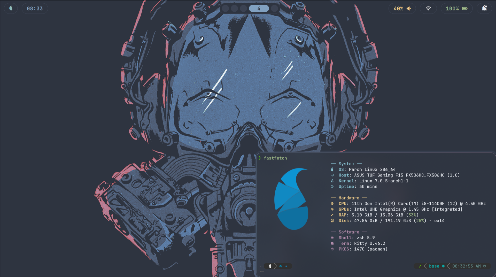

# Minimal Hyprland Setup – One Dark Theme

A minimal, keyboard‑driven Hyprland configuration featuring the **One Dark** color scheme.  
Supports both `.conf` (default) and `.lua` configuration styles – you choose.





<video src="demo.mp4" controls width="100%"></video>

## 📦 Packages Used

| Category             | Packages                               |
| -------------------- | -------------------------------------- |
| **Core**             | `hyprland`                             |
| **Bar / Launcher**   | `waybar`, `rofi`                       |
| **Notifications**    | `swaync`                               |
| **Wallpaper**        | `swww` (with `awww` daemon & GUI)      |
| **Authentication**   | `polkit-kde-agent`                     |
| **Portal**           | `xdg-desktop-portal` (Hyprland aware)  |
| **Logout**           | `wlogout`                              |
| **Screenshots**      | `grim`, `slurp`                        |
| **Clipboard**        | `cliphist`, `wl-copy` (`wl-clipboard`) |
| **QT / GTK Theming** | `qt5ct`, `qt6ct`, `nwg-look`           |
| **Idle / Lock**      | `hypridle`, `hyprlock`                 |
| **Network**          | `nm-applet`                            |
| **OSD**              | `swayosd`                              |

## 📂 Configuration Structure

Configs live in `~/.config/`:

```md
~/.config/
├── hypr/ # hyprland.conf (or .lua alternative)
├── waybar/ # waybar config & style
├── rofi/ # rofi config & themes
├── swaync/ # notification daemon config
├── swww/ # wallpaper cache (awww uses this)
├── wlogout/ # logout menu layout
├── cliphist/ # clipboard history (optional)
├── qt5ct/ # Qt5 settings (Breeze Dark)
├── qt6ct/ # Qt6 settings (Breeze Dark)
├── nwg-look/ # GTK settings (Breeze)
└── hypridle.conf # idle timeout rules
```

Configs live in `~/.local/bin/`:

```md
~/.local/bin
├── wallset
```

Wallpapers in `~/Pictures/wallpapers/`:

```md
~/Pictures/wallpapers
├── nord.png
├── rose-pine.png
├── one-dark.png
└── Rain.jpg
```

> 💡 **Lua alternative** – If you prefer Lua, rename/duplicate `hyprland.conf` to `hyprland.lua` and adjust syntax. The core keybindings remain identical.

## 🚀 Installation

### 1. Install the required packages

**Arch / Arch Based Distros (pacman):**

```bash
sudo pacman -S hyprland waybar rofi swaync swww polkit-kde-agent \
  xdg-desktop-portal-hyprland wlogout grim slurp cliphist wl-clipboard \
  qt5ct qt6ct nwg-look hypridle hyprlock network-manager-applet swayosd
```

**Optional GUI for swww:** `awww` – clone from [GitHub](https://github.com/arzamazi/awww) or use `yay -S awww-git`.

### 2. Clone or copy your dotfiles

```bash
git clone https://github.com/farzamvalizade/hyprland-one-dark ~/.config
```

(Adjust to your actual dotfiles location.)

### 3. First launch

- Log out of your current session.
- From your display manager (or TTY) select **Hyprland**.
- If no DM, start with `Hyprland` from the TTY.

## 🎨 Theming Details

- **Colors:** One Dark palette defined in `~/.config/waybar/colors/colors.css`
- **GTK / Qt:**
  - `nwg-look` → **Breeze** theme, dark variant.
  - `qt5ct` & `qt6ct` → **Breeze Dark** (apply once, then apps follow).
- **Bar & Notifications:** Waybar and swaync styled with One Dark.
- **Wallpaper:** `awww` daemon runs at startup (set via `awww img /path/to/image`).

## ⌨️ Keybindings

| Action              | Shortcut                                    |
| ------------------- | ------------------------------------------- |
| **Terminal**        | `SUPER` + `Return`                          |
| **App launcher**    | `SUPER` + `D`                               |
| **Close window**    | `SUPER` + `W`                               |
| **Toggle float**    | `SUPER` + `F`                               |
| **Screenshot**      | `PrtSc` (full screen)                       |
| **Lock session**    | `SUPER` + `L`                               |
| **Logout menu**     | `SUPER` + `M`                               |
| **Volume up**       | `Fn` + `F3`                                 |
| **Volume down**     | `Fn` + `F2`                                 |
| **Mute**            | `Fn` + `F1`                                 |
| **Brightness up**   | `Fn` + `F8`                                 |
| **Brightness down** | `Fn` + `F7`                                 |
| **Custom bindings** | `SUPER` + `P`, `SUPER` + `J` (just dwindle) |

> 🔧 **Note:** Volume & brightness OSD is provided by `swayosd` – shows overlay on change.

## 🧩 Autostart (`exec-once`)

The following services start automatically with Hyprland:

```bash
waybar & awww-daemon & swaync
/usr/lib/xdg-desktop-portal -r & /usr/lib/polkit-kde-authentication-agent-1
wl-paste --type text --watch cliphist store & wl-paste --type image --watch cliphist store
hypridle
nm-applet
swayosd-server
```

- **`cliphist`** stores both text and image clipboard history – recall with `cliphist list | rofi -dmenu | cliphist decode | wl-copy`.
- **`hypridle`** locks the screen after inactivity (configured in `hypridle.conf`).
- **`nm-applet`** gives a system tray network icon.

## 🖼️ Usage Guide

### Wallpaper (swww + awww)

- **Set a wallpaper:** `swww img ~/wallpapers/one-dark.png`
- **Graphical browser:** run `awww` (GUI) to pick and apply.
- The daemon (`awww-daemon`) ensures wallpapers persist.

### Screenshots (grim + slurp)

- **Area Binding:** `PrtSc` → saves in your clipboard.

### Clipboard history (cliphist)

- View history: `SUPER + V`

### Notifications (swaync)

- Click on the waybar notification icon to open the notification center.
- Right‑click an entry to dismiss.

### Lock & Idle

- **Manual lock:** `SUPER + L` triggers `hyprlock`.
- **Automatic lock:** `hypridle` locks after 5 minutes of inactivity (adjust in `hypridle.conf`).

### Logout menu (wlogout)

- Press `SUPER + M` to show a grid with **logout**, **reboot**, **shutdown**, **suspend**, **lock**.
- Use mouse or keyboard (arrow keys + Enter).

### Network (nm-applet)

- Look for the network icon in waybar’s tray (right side).
- Left‑click to open the connection menu, right‑click for advanced options.

### Volume / Brightness OSD

- Use the `Fn` keys above – `swayosd` displays a smooth overlay.
- If OSD doesn’t appear, ensure `swayosd-server` is running (`ps aux | grep swayosd`).

## 🛠️ Troubleshooting

| Problem                                       | Likely fix                                                                                                                           |
| --------------------------------------------- | ------------------------------------------------------------------------------------------------------------------------------------ |
| **Screen sharing (Discord/Zoom) not working** | Install `xdg-desktop-portal-hyprland` and restart the portal: `killall xdg-desktop-portal; /usr/lib/xdg-desktop-portal -r`           |
| **Clipboard history not saving**              | Run `cliphist` manually: `wl-paste --watch cliphist store` – check it's in `exec-once`                                               |
| **GTK apps look wrong**                       | Open `nwg-look`, select **Breeze** and **Dark**, then click **Apply**. For Qt apps, open `qt5ct` / `qt6ct` and choose `Breeze Dark`. |
| **`awww` doesn’t set wallpaper**              | Make sure `swww-daemon` is running (`ps aux \| grep swww`). If missing, run `swww-daemon &` before `awww`.                           |
| **Waybar shows no icons**                     | Install a nerd‑fonts patched font (e.g., `ttf-nerd-fonts-symbols`) and set it in `waybar/style.css`.                                 |
| **Hypridle doesn’t lock**                     | Check that `hypridle` is running and that `hyprlock` is installed. Test with `hyprlock` manually.                                    |

## 📝 Customization Tips

- **Change keybindings** – Edit `~/.config/hypr/settings/keybinds.conf` (or `.lua`). Look for the `bind =` lines.
- **Add your own wallpaper** – Use `swww img` or `awww`. To make it persistent, edit `exec-once` to set a specific image.
- **Switch to Lua config** – Rename `hyprland.backup.lua` to `hyprland.lua` and paste the `settings/lua` files in `settings/` and delete .conf files – see [Hyprland Wiki](https://wiki.hypr.land).
- **Edit the logout menu** – Modify the layout in `~/.config/wlogout/` (`.css` and `.layout` files).

---

**Enjoy your clean, One Dark Hyprland desktop!**  
For further help, check the [Hyprland Wiki](https://wiki.hypr.land) or the individual tool documentation.
**If you like my configs, don't forget to leave a star ⭐**
